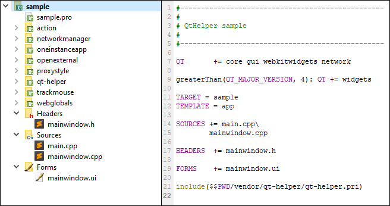

# Qt-helper

Simple Qt library to improve and help in their projects



## Usage:

For use all classes add in your project something like this:

```
QT += core gui webkitwidgets network

greaterThan(QT_MAJOR_VERSION, 4): QT += widgets

TARGET = application
TEMPLATE = app

SOURCES  += main.cpp

include($$PWD/vendor/qt-helper/qt-helper.pri)
```

**Note:** vendor é apenas um exemplo de pasta aonde pode adicionar projetos bibliotecas de terceiros, um exemplo de estrutura de pastas:

```
sample/
├───main.cpp
├───mainwindow.cpp
├───mainwindow.h
├───mainwindow.ui
├───sample.pro
└───vendor/
    └───qt-helper/
        └───qt-helper.pri
```

## Application

The classes in this scope are used to adjust or control anything related to your application, or `QApplication`, or add extra functionality.

### debugger

This class only has static methods, and they are equivalent to `qDebug`, with the difference of being able to enable or disable them as necessary. Usage example:

```cpp
#include "debugger.h"
#include <QApplication>

int main(int argc, char *argv[])
{
    QApplication app(argc, argv);

// show "logs" only in DEBUG (build in debug)
#ifdef QT_DEBUG
    Debugger(true);
#else
    Debugger(false);
#endif

    ...

    return app.exec();
}
```

### oneinstanceapp

This class allows your application to only have one instance. Usage example:

```cpp
#include "mainwindow.h"
#include "oneinstanceapp.h"

int main(int argc, char *argv[])
{
    OneInstanceApp app(argc, argv);

    MainWindow win;
    win.show();

    return app.exec("~instance");
}
```

## Desktop

Instructions for use and how to include individually:

### action

```cpp
#include "mainwindow.h"
#include "ui_mainwindow.h"

#include "action.h"

MainWindow::MainWindow(QWidget *parent) : QMainWindow(parent), ui(new Ui::MainWindow)
{
    ui->setupUi(this);

    Action::widget(this, "Ctrl+w", this, SLOT(close()));
    Action::widget(this, "F12", this, SLOT(screenshot()));
}

void MainWindow::screenshot()
{
    ...
}
```

### openexternal

```cpp
#include "mainwindow.h"
#include "ui_mainwindow.h"

#include "action.h"

MainWindow::MainWindow(QWidget *parent) : QMainWindow(parent), ui(new Ui::MainWindow)
{
    ui->setupUi(this);

    QObject::connect(ui->btn1, SIGNAL(clicked()), this, SLOT(showFileInExplorer()));
    QObject::connect(ui->btn2, SIGNAL(clicked()), this, SLOT(openFile()));
}

void MainWindow::showFileInExplorer()
{
    OpenExternal::url("http://github.com");
}

void MainWindow::showFileInExplorer()
{
    OpenExternal::showInFolder("C:/foder/file.txt");
}

void MainWindow::openFile()
{
    OpenExternal::local("C:/foder/file.txt");
}
```

Method | Description
--- | ---
`OpenExternal::local("C:/foo/bar/")` | Open default file manager (`explorer.exe` in Windows and `Finder` in macOS)
`OpenExternal::local("C:/foo/bar.txt")` | Try open with default program, if failed try use `OpenExternal::showInFolder`
`OpenExternal::showInFolder("C:/foo/bar.txt")` | In Windows is equivalent to `explorer /select,C:\foder\file.txt` command
`OpenExternal::showInFolder("/home/foo.txt")` | In macOS is equivalent to `open -R /home/foo.txt` command
`OpenExternal::url("http://github.com")` | Open default web-browser

### trackmouse

```cpp
#include "trackmouse.h";

...

Sample::Sample(QWidget *parent) : QWidget(parent)
{
    TrackMouse *track = new TrackMouse(this);
    QObject::connect(track, SIGNAL(position(QPoint)), this, SLOT(capture(QPoint)));
    track->setDelay(1000); // Set delay (default is 100 ms)
    track->setWidget(this, true);
    track->enable(true);
    track->start();
}

Sample::capture(const QPoint position)
{
    qDebug() << position;
}
```

## Network

### networkmanager

```cpp
#include "networkmanager.h"

...

NetworkManager *manager = new NetworkManager;
manager->setCookieJar(new QNetworkCookieJar);
manager->setCache(new QNetworkDiskCache);

...

// Set NetworkManager to QWebPage
ui->webView->page()->setNetworkAccessManager(manager);

...
```

## Style

### proxystyle

```cpp
#include "mainwindow.h"
#include "proxystyle.h"
#include <QApplication>

int main(int argc, char *argv[])
{
    QApplication app(argc, argv);

    app.setStyle(new ProxyStyle);

    MainWindow win;
    win.show();

    return app.exec("~instance");
}
```

## Webkit

### webglobals

```cpp
WebGlobals configs();
configs.developer(true); // Enable developer tools
configs.setPath("C:/foo/bar/"); // Set folder for cookies, storage, and others
```

Method | Description
--- | ---
`WebGlobals::developer(const bool enable)` | Enable or disable developer tools
`QWebSettings *WebGlobals::configs()` | Same as `QWebSettings::globalSettings()`
`WebGlobals::setStyle(const QString path)` | Specifies the location of a user stylesheet to load with every web page
`WebGlobals::setFont(const int size, const QString font)` | Sets the font size and sets the actual font family to family for the specified generic family, which.
`QIcon WebGlobals::getIcon(const QString url)` | Get icon from URL
`WebGlobals::setPath(const QString path)` | Define folder for your browser profile data
`QString WebGlobals::getPath(const WebData type)` | Get full path from your browser profile data
`WebGlobals::getPath(WebData::All)` | Get path your browser profile
`WebGlobals::getPath(WebData::AppCache)` | Get cache path from  your browser profile
`WebGlobals::getPath(WebData::LocalStorage)` | Get localstorage path from  from your browser profile
`WebGlobals::getPath(WebData::OfflineStorage)` | Get offline path from  from your browser profile
`WebGlobals::getPath(WebData::Icons)` | Get icons path from  from your browser profile
`WebGlobals::getPath(WebData::Temporary)` | Get temporary path from  your browser profile
`bool WebGlobals::erase(const WebData type)` | Erase data by type from your browser profile data
`WebGlobals::erase(WebData::All)` | Erase all data from your browser profile data
`WebGlobals::erase(WebData::AppCache)` | Erase cache from your browser profile data
`WebGlobals::erase(WebData::LocalStorage)` | Erase localstorage data from your browser profile data
`WebGlobals::erase(WebData::OfflineStorage)` | Erase offline data from your browser profile data
`WebGlobals::erase(WebData::Icons)` | Erase icons data from your browser profile data
`WebGlobals::erase(WebData::Temporary)` | Erase temporary data your browser profile data
