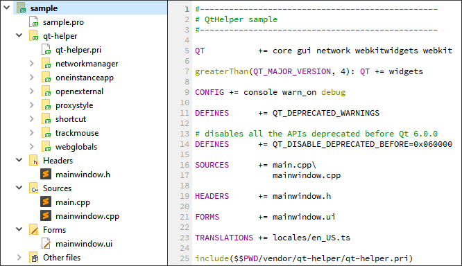

# Qt-helper

Simple Qt library to improve and help in their projects



## Usage:

For use all classes add in your project something like this:

```
QT += core gui webkitwidgets network

greaterThan(QT_MAJOR_VERSION, 4): QT += widgets

TARGET = application
TEMPLATE = app

SOURCES  += main.cpp

include($$PWD/vendor/qt-helper/qt-helper.pri)
```

**Note:** `vendor` is just a suggestion on how to organize your folders, to add third-party libraries:

```
sample/
├─── main.cpp
├─── mainwindow.cpp
├─── mainwindow.h
├─── mainwindow.ui
├─── sample.pro
└─── vendor/
     └─── qt-helper/
          ├─── application/
          │    ├─── oneinstanceapp.cpp
          │    ├─── oneinstanceapp.h
          │    ├─── oneinstanceapp.pri
          │    ├─── proxystyle.cpp
          │    ├─── proxystyle.h
          │    └─── proxystyle.pri
          │
          ├─── desktop/
          │    ├─── action.cpp
          │    ├─── action.h
          │    ├─── action.pri
          │    ├─── openexternal.cpp
          │    ├─── openexternal.h
          │    ├─── openexternal.pri
          │    ├─── trackmouse.cpp
          │    ├─── trackmouse.h
          │    └─── trackmouse.pri
          │
          ├─── network/
          │    ├─── networkmanager.cpp
          │    ├─── networkmanager.h
          │    └─── networkmanager.pri
          │
          └─── webkit/
               ├─── webglobals.cpp
               ├─── webglobals.h
               └─── webglobals.pri
```

## Application

The classes in this scope are used to adjust or control anything related to your application, or `QApplication`, or add extra functionality.

### oneinstanceapp

This class allows your application to only have one instance. Usage example:

```cpp
#include "mainwindow.h"
#include "oneinstanceapp.h"

int main(int argc, char *argv[])
{
    OneInstanceApp app(argc, argv);

    MainWindow win;
    win.show();

    return app.exec("~instance");
}
```

> For include ony `OnceInstanceApp` in your application put in your `.pro`, eg.:
>
> ```
> ...
>
> SOURCES  += main.cpp
>
> include($$PWD/vendor/qt-helper/application/oneinstanceapp.pri)
> ```

### proxystyle

Adjust the style and improve the combobox popup:

```cpp
#include "mainwindow.h"
#include "proxystyle.h"
#include <QApplication>

int main(int argc, char *argv[])
{
    QApplication app(argc, argv);

    app.setStyle(new ProxyStyle());

    MainWindow win;
    win.show();

    return app.exec("~instance");
}
```

Method | Description
--- | ---
`new ProxyStyle()` | Default theme
`new ProxyStyle("Fusion")` | Define fusion theme in application¹
`new ProxyStyle("Windows")` | Define Windows theme in application¹
`new ProxyStyle("WindowsXP")` | Define Windows XP theme in application¹
`new ProxyStyle("WindowsVista")` | Define Windows Vista theme in application¹

> ¹ Default themes depend on system availability

For custom theme you can extends like this:

```cpp
class CustomStyle : public ProxyStyle
{
    Q_OBJECT

public:
    CustomStyle();
    ...
}

...

app.setStyle(new CustomStyle());

...
```

More details:

- Qt5: https://doc.qt.io/qt-5/qtwidgets-widgets-styles-example.html
- Qt6: https://doc.qt.io/qt-6.2/qtwidgets-widgets-styles-example.html
- Gallery: https://doc.qt.io/qt-6/gallery.html

> For include ony `ProxyStyle` in your application put in your `.pro`, eg.:
>
> ```
> ...
>
> SOURCES  += main.cpp
>
> include($$PWD/vendor/qt-helper/aplication/proxystyle.pri)
> ```

## Desktop

Instructions for use and how to include individually:

### action

```cpp
#include "mainwindow.h"
#include "ui_mainwindow.h"

#include "action.h"

MainWindow::MainWindow(QWidget *parent) : QMainWindow(parent), ui(new Ui::MainWindow)
{
    ui->setupUi(this);

    Action::widget(this, "Ctrl+w", this, SLOT(close()));
    Action::widget(this, "F12", this, SLOT(screenshot()));
}

void MainWindow::screenshot()
{
    ...
}
```

> For include ony `OnceInstanceApp` in your application put in your `.pro`, eg.:
>
> ```
> ...
>
> SOURCES  += main.cpp
>
> include($$PWD/vendor/qt-helper/desktop/action.pri)
> ```

### openexternal

Prevent freeze (or crash) apps with `QDesktopServices::openUrl`:

```cpp
#include "mainwindow.h"
#include "ui_mainwindow.h"

#include "action.h"

MainWindow::MainWindow(QWidget *parent) : QMainWindow(parent), ui(new Ui::MainWindow)
{
    ui->setupUi(this);

    QObject::connect(ui->btn1, SIGNAL(clicked()), this, SLOT(showFileInExplorer()));
    QObject::connect(ui->btn2, SIGNAL(clicked()), this, SLOT(openFile()));
}

void MainWindow::showFileInExplorer()
{
    OpenExternal::url("http://github.com");
}

void MainWindow::showFileInExplorer()
{
    OpenExternal::showInFolder("C:/foder/file.txt");
}

void MainWindow::openFile()
{
    OpenExternal::open("C:/foder/file.txt");
}
```

Method | Description
--- | ---
`OpenExternal::open("C:/foo/bar/")` | Open default file manager (`explorer.exe` in Windows or `Finder` in macOS)
`OpenExternal::open("C:/foo/file.txt")` | Try open with default program, if failed try use `OpenExternal::showInFolder`
`OpenExternal::showInFolder("C:/foo/file.txt")` | In Windows is equivalent to `explorer /select,C:\foder\file.txt` command
`OpenExternal::showInFolder("/Users/sample/Desktop/foo.txt")` | In macOS is equivalent to `open -R /Users/sample/Desktop/foo.txt` command

> For include ony `OpenExternal` in your application put in your `.pro`, eg.:
>
> ```
> ...
>
> SOURCES  += main.cpp
>
> include($$PWD/vendor/qt-helper/desktop/openexternal.pri)
> ```

### trackmouse

```cpp
#include "trackmouse.h";

...

Sample::Sample(QWidget *parent) : QWidget(parent)
{
    TrackMouse *track = new TrackMouse(this);
    QObject::connect(track, SIGNAL(position(QPoint)), this, SLOT(capture(QPoint)));
    track->setDelay(1000); // Set delay (default is 100 ms)
    track->setWidget(this, true);
    track->enable(true);
    track->start();
}

Sample::capture(const QPoint position)
{
    qDebug() << position;
}
```

> For include ony `TrackMouse` in your application put in your `.pro`, eg.:
>
> ```
> ...
>
> SOURCES  += main.cpp
>
> include($$PWD/vendor/qt-helper/desktop/trackmouse.pri)
> ```

## Network

### networkmanager

This class fix problems with "Response unknown" that occurs with some servers:

```cpp
#include "networkmanager.h"

...

NetworkManager *manager = new NetworkManager;
manager->setCookieJar(new QNetworkCookieJar);
manager->setCache(new QNetworkDiskCache);

...

// Set NetworkManager to QWebPage
ui->webView->page()->setNetworkAccessManager(manager);

...
```

> For include ony `NetworkManager` in your application put in your `.pro`, eg.:
>
> ```
> ...
>
> SOURCES  += main.cpp
>
> include($$PWD/vendor/qt-helper/network/networkmanager.pri)
> ```

## Webkit

### webglobals

Adjustments for QtWebkit made easy:

```cpp
WebGlobals configs();
configs.developer(true); // Enable developer tools
configs.setPath("C:/foo/bar/"); // Set folder for cookies, storage, and others
```

Method | Description
--- | ---
`WebGlobals::developer(const bool enable)` | Enable or disable developer tools
`QWebSettings *WebGlobals::configs()` | Same as `QWebSettings::globalSettings()`
`WebGlobals::setStyle(const QString path)` | Specifies the location of a user stylesheet to load with every web page
`WebGlobals::setFont(const int size, const QString font)` | Sets the font size and sets the actual font family to family for the specified generic family, which.
`QIcon WebGlobals::getIcon(const QString url)` | Get icon from URL
`WebGlobals::setPath(const QString path)` | Define folder for your browser profile data
`QString WebGlobals::getPath(const WebData type)` | Get full path from your browser profile data
`WebGlobals::getPath(WebData::All)` | Get path your browser profile
`WebGlobals::getPath(WebData::AppCache)` | Get cache path from  your browser profile
`WebGlobals::getPath(WebData::LocalStorage)` | Get localstorage path from  from your browser profile
`WebGlobals::getPath(WebData::OfflineStorage)` | Get offline path from  from your browser profile
`WebGlobals::getPath(WebData::Icons)` | Get icons path from  from your browser profile
`WebGlobals::getPath(WebData::Temporary)` | Get temporary path from  your browser profile
`bool WebGlobals::erase(const WebData type)` | Erase data by type from your browser profile data
`WebGlobals::erase(WebData::All)` | Erase all data from your browser profile data
`WebGlobals::erase(WebData::AppCache)` | Erase cache from your browser profile data
`WebGlobals::erase(WebData::LocalStorage)` | Erase localstorage data from your browser profile data
`WebGlobals::erase(WebData::OfflineStorage)` | Erase offline data from your browser profile data
`WebGlobals::erase(WebData::Icons)` | Erase icons data from your browser profile data
`WebGlobals::erase(WebData::Temporary)` | Erase temporary data your browser profile data

> For include ony `WebGlobals` in your application put in your `.pro`, eg.:
>
> ```
> ...
>
> SOURCES  += main.cpp
>
> include($$PWD/vendor/qt-helper/web/webglobals.pri)
> ```
